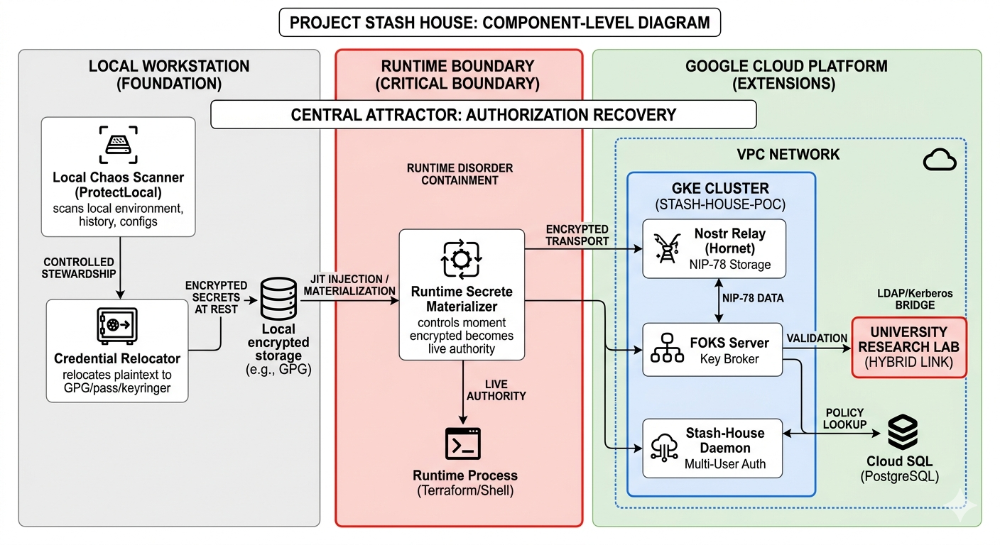

::: titlepage
::: center
(1,0)400\
[Stash House]{.smallcaps}\
(1,0)400\
:::

::: center
[Franklin Diaz]{.smallcaps}\
\[2.5in\] March 11, 2026\
\
:::
:::

# Introduction

The modern developer workstation is characterized by high entropy. Credentials for cloud providers, internal databases, and CI/CD pipelines often accumulate in plaintext artifacts, history files, and unencrypted configuration directories. Traditional approaches to secret management typically emphasize \"Pre-Commit\" prevention, yet they offer little guidance for the recovery of stewardship once an environment has reached a state of disorder.

Project Stash House is best understood not as a new storage vault, but as a system for the restoration of secret stewardship under workflow pressure. The foundational achievement of the project is the creation of a local hygiene scaffold that identifies leakage and relocates authority into an encrypted, manageable discipline without destroying developer velocity.

# System Architecture

The architecture of Stash House is bifurcated into a structurally real foundational layer and a boltable extension layer.\

<figure>

<figcaption>Project Stash House: Authority Recovery and Materialization Boundary.</figcaption>
</figure>

Here is a view of the component relationships.\
\

-   **Horizontal Flow (Foundation):** Represents the primary operator ProtectLocal. It shows the movement from Local Disorder (plaintext) to Encrypted Stewardship.

-   **Vertical Flow (Boundary):** The red dashed line and the arrow to Runtime Execution represent the Materialization Boundary. This is where the research analyzes the risk of secrets becoming \"live.\"

-   **Bottom Layer (Extensions):** This represents the GCP infrastructure you are requesting. It shows how the local vault is projected into a Distributed/Federated state via Nostr and FOKS, while bridging to institutional LDAP/Kerberos.

## The Foundational Layer: Local Stewardship

The primary operator, *ProtectLocal*, performs a scan-identify-relocate cycle. By utilizing workstation-native tools such as GPG and *pass*, we establish a \"Hygiene Boundary\" that prevents plaintext sprawl.

## The Critical Boundary: Runtime Materialization

The highest-risk surface identified in this research is the *Materialization Boundary*. This is the precise moment when encrypted, stored secrets are reconstituted for use by execution environments (e.g., Terraform, Shell). Our research investigates JIT (Just-In-Time) injection patterns to minimize the temporal window of live-secret exposure.

## The Extension Layer: Federated Identity

The projected architecture leverages Google Kubernetes Engine (GKE) and the Nostr protocol to move from a \"local-only\" model to a distributed vault.

-   **Nostr Transport:** Utilizing NIP-78 for resilient, double-encrypted storage across decentralized relays.

-   **FOKS Integration:** Employing the Federated Open Key Service to manage brokered key release via hardware tokens.

-   **Enterprise Bridge:** Facilitating a site-to-site tunnel to institutional LDAP and Kerberos servers for identity mapping.

# Decentralized State Management via NIP-78 {#sec:nip78_shift}

The architectural transition from local, static configuration files to the *Nostr Implementation Possibility 78* (NIP-78) protocol represents a fundamental shift in the `stash-house` methodology. By migrating from workstation-specific storage to a decentralized, event-based transport layer, we mitigate the inherent fragility of the \"local-only\" secret paradigm.

## Mechanism of Application-Specific Data

NIP-78 defines a standard for \"Application-specific data\" (`kind:30078`), utilizing replaceable events to store arbitrary ciphertext indexed by a unique `d-tag`. In the `stash-house` context, this event serves as a \"Virtual Vault.\" Unlike ephemeral social events, `kind:30078` ensures that the most recent iteration of a user's credential state is persisted across the relay network.

## Technical Justification for the Shift

The adoption of NIP-78 over traditional local flat-files or centralized databases provides three primary advantages:

-   **Decentralized Redundancy:** Broadcasting the vault state to multiple relays---specifically the private `Hornet` instance within our GKE cluster---eliminates the workstation as a single point of failure.

-   **Cryptographic Sovereignty:** Since events are signed using the user's Schnorr-based Nostr identity, the infrastructure remains content-agnostic. The cloud provider hosts the data without ever possessing the keys required for its decryption.

-   **Materialization Agnostic:** NIP-78 allows the `stash-house` CLI to retrieve state across disparate environments (e.g., local shell, cloud-hosted dev container, or CI/CD runner) without requiring manual secret synchronization.

## Interaction with the FOKS Layer

While NIP-78 facilitates the *transport* and *storage* of the vault, the *Federated Open Key Service* (FOKS) provides the brokered decryption logic. This separation ensures that the transport layer remains decentralized and resilient, while the authorization layer remains governed by the institutional policies defined in our University Research Lab (via the HA VPN bridge).

# Related Work

The landscape of secret management is currently divided between centralized enterprise vaulting and decentralized personal identity. stash-house occupies the intersection of these domains, focusing on the transition from local disorder to federated stewardship.

## Secret Scanning and Hygiene

Traditional approaches to credential security, such as GitGuardian or Gitleaks, focus primarily on the \"Pre-Commit\" phase of the development lifecycle. While effective at preventing new leaks, they offer little utility for the remediation of existing workstation entropy. stash-house builds upon this foundation but shifts the attractor from simple detection to active authority recovery [@stashhouse].

## Decentralized Transport and Storage

The use of the Nostr protocol as a transport layer represents a departure from centralized \"fortress\" models. By utilizing NIP-78 for application-specific data [@nip78], we achieve a resilient, multi-relay distribution of ciphertext. To ensure the integrity of this distributed state, we implement cryptographic standards defined in NIP-44 [@nip44], which provides a robust version-2 encryption scheme more suitable for infrastructure secrets than previous iterations.

## Federated Authority and Enterprise Bridging

The \"Extensions\" layer of our research relies on the coordination of disparate identity authorities. The Federated Open Key Service (FOKS) provides the mechanical basis for brokered key release [@foks], allowing for hardware-backed security in a non-proprietary framework. This is critical for our bridge to enterprise identity. By referencing established protocols like Kerberos [@kerberos] and OpenLDAP [@openldap], we ensure that the sovereign identity reclaimed on the workstation can be mapped to institutional governance without compromising the developer's local autonomy.

## The Materialization Boundary

While tools like 1Password and HashiCorp Vault address secret storage, there is limited academic focus on the \"Materialization Boundary\"---the exact moment a secret enters a runtime process memory. Our work expands upon the foundational concepts of ticket-based authentication found in Kerberos [@kerberos] to investigate just-in-time materialization, aiming to minimize the temporal window of exposure during automated infrastructure execution.

# Conclusion

Project Stash House demonstrates that decentralized identity is not merely an automatic extension of encrypted storage, but a distinct operator that must be stabilized by local discipline. By focusing on authority recovery and the containment of runtime exposure, we provide a framework for organizations to adopt sovereign identity protocols while maintaining the rigor of enterprise governance.

::: versionhistory
:::
